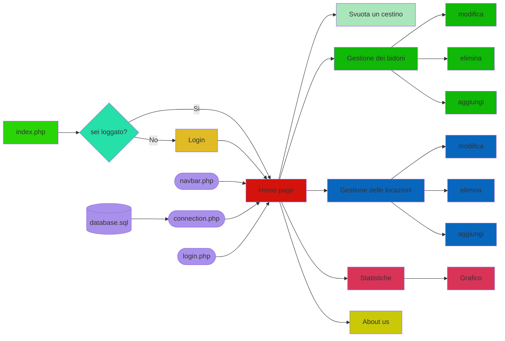

# Gestione Raccolta Differenziata Malignani

Progetto scolastico svolto nel quarto anno di Istituto Tecnico Informatico assieme a Ray Guzzo e Nicholas Comino.

## Di cosa si tratta

Nel 2022, sotto la guida del professor Dereani, docente di informatica presso l'I.S.I.S. A. Malignani di Udine, io e alcuni miei compagni di classe abbiamo costruito un sito per la gestione efficiente dei nuovi bidoni per la raccolta differenziata presenti all'interno dell'istituto.
Ottimizzato per smartphone, il sito è stato pensato per l'uso diretto da parte del personale della scuola. 

## Come funziona

Inquadrando un codice QR posto sul bidone, si potrà agevolmente accedere all'interfaccia che permette di registrarne la capienza e segnarne lo svuotamento. Ogni piazzetta contenente i bidoni è stata mappata all'interno dell'istituto, l'interfaccia prevede la gestione delle posizioni dei bidoni direttamente dall'utente.

## Obiettivo

Il progetto punta alla semplificazione delle operazioni per l'ottenimento dei dati in merito all'uso della raccolta differenziata all'interno dell'istituto, rendendo il lavoro del personale più semplice. Punta, inoltre, a una più efficiente gestione e organizzazione dei vari punti di raccolta e dei vari bidoni, ottenendo un registro sempre aggiornato sulle posizioni e sullo stato dei rifiuti.

## Funzionalità

* Autenticazione: il sito è accessibile solo dal personale autorizzato tramite apposite procedure di login;

* Generazione dinamica dei codici QR: i codici da apporre sopra i bidoni sono generabili direttamente dal sito sfruttando le API di Google, in caso di spostamento o riorganizzazione del bidone sarà semplice generare un nuovo codice QR;

* Statistiche: i dati raccolti vengono mostrati in maniera statistica attraverso un'apposita interfaccia;

* Indipendenza da amministratore: il sito è strutturato in modo da fornire la maggior autonomia nelle operazioni da parte del personale, tutte le informazioni sono modificabili da parte dell'utente, rendendo necessario l'intervento dell'amministratore solo in casi strettamente specifici;

## Diagramma di flusso



## Indice dei contenuti

### Dipendenze 

**- Svuota un cestino:** 
-  index.php
-  svuotamento.php
-  Altro(login.php, connection.php, navbar.php)

**- Gestione dei bidoni:** 
-  gestione_bidoni.php
-  modify.php
-  delete.php
-  add.php
-  Altro(login.php, connection.php, navbar.php)

**- Gestione delle locazioni:** 
-  gestione_locazioni.php
-  modify.php
-  delete.php
-  add.php
-  Altro(login.php, connection.php, navbar.php)

**- Statistiche:** 
-  indexStats.php
-  graficoSvuotamenti.php
-  grafico.php
-  grafico_test.php
-  role_management.php
-  user_managment.php
-  stats.php
-  Altro(connection.php)

**- About us:** 
-  aboutus.php
-  Altro(navbar.php)
</p>
</details>

## Documentazione 

<details><summary>index.php</summary>
<p>

### index.php

**E' la pagina di indirizzamento iniziale, reindirizza alla pagina di login se necessario**
- richiede connection.php per instaurare la connessione
- permette di svuotare un cestino inserendo la locazione ed il bidone

**richiede connection.php per instaurare la connessione**

**richiede navbar.php per usufruire della navbar**

```php
    <?php

  // connessione
  require_once "server/connection.php";

  // individuazione locazione
  $bidoniPerPunto = [];
  $nominativo = [];
  $parametroPunto = "";

  mysqli_select_db($connessione, "DBrifiuti");
  $queryPunti = "select * from tblLocazione";
  $risultatoPunti = mysqli_query($connessione, $queryPunti);

  // individuazione dei bidoni per il punto selezionato
  if (isset($_GET['puntiRaccolta']) && $_GET['puntiRaccolta'] != "null") {

    $parametroPunto = $_GET['puntiRaccolta'];
    $query = "select * from tblBidone where fkLocazione=".$_GET['puntiRaccolta'];
    $risultato = mysqli_query($connessione, $query);

    while ($riga = mysqli_fetch_array($risultato, MYSQLI_ASSOC)) {
      $bidone = [$riga['pkID'], $riga['TipoRifiuti'], $riga['fkLocazione']];
      array_push($bidoniPerPunto, $bidone);
    }
  }

 ?>

<!DOCTYPE html>
<html lang="en" dir="ltr">
  <head>
    <meta charset="utf-8">
    <meta name="viewport" content="width=device-width, initial-scale=1">
    <title>Gestione Rifiuti</title>
    <link href="https://cdn.jsdelivr.net/npm/bootstrap@5.2.0-beta1/dist/css/bootstrap.min.css" rel="stylesheet" integrity="sha384-0evHe/X+R7YkIZDRvuzKMRqM+OrBnVFBL6DOitfPri4tjfHxaWutUpFmBp4vmVor" crossorigin="anonymous">
  </head>
  <body>
    <?php

    include "navbar.php";

    if ($accessoSessione == false && $accessoCookie == false) {
      print "<script>window.location = 'login.php'</script>";
    }

    ?>

    <div class="container-md d-flex justify-content-center mx-auto my-3 flex-column">
      <form action="index.php" method="get">
        <div class="input-group mb-3">
            <label class="input-group-text" for="inputGroupSelect01">Seleziona una locazione</label>
            <select class="form-select" id="inputGroupSelect01" onchange="this.form.submit()" name="puntiRaccolta">
              <option selected>Nessun punto selezionato...</option>
              <?php
                while ($bidone = mysqli_fetch_array($risultatoPunti, MYSQLI_ASSOC)) {
                  if ($parametroPunto == $bidone['pkID']) {
                    print '<option value="'.$bidone['pkID'].'" selected>'.$bidone['Descrizione'].'</option>';
                  } else {
                    print '<option value="'.$bidone['pkID'].'">'.$bidone['Descrizione'].'</option>';
                  }

                }
               ?>
            </select>
        </div>
      </form>

      <?php
        if (isset($_GET['successo'])) {
          print '<div class="alert alert-success" role="alert">Svuotamento eseguito con successo!</div>';
        }
       ?>

      <?php
        if (isset($_GET['puntiRaccolta'])) {
          print '<div class="container border border-1 rounded">';
          print '<form action="server/svuotamento.php" method="post">';
          print '<div class="row">';

          foreach ($bidoniPerPunto as $bidone) {
            print '<div class="col-sm-6 mt-3">';
            print '<div class="card">';
            print '<div class="card-body">';

            print '<h5 class="card-title">'.$bidone[1].'</h5>'; // nome del bidone
            print '<h6 class="card-subtitle mb-2 text-muted">ID: '.$bidone[0].'</h6>'; // id del bidone
            print '<label for="customRange2" class="form-label">% svuotamento</label>';
            print '<input type="range" class="form-range" min="0" max="100" id="customRange2" name="slider_bidone[]">'; // slider del bidone
            print '<input type="hidden" name="bidone_selezionato[]" value="'.$bidone[0].'">'; // id del bidone da passare

            print '</div>';
            print '</div>';
            print '</div>';

          }

          print '</div>';

          print '<div class="d-flex justify-content-center my-3">';
          print '<button type="button" class="btn btn-primary" onclick="this.form.submit()">Registra svuotamento</button>';
          print '</div>';

          print '</form>';
          print '</div>';
        }
      ?>

    </div>

    <script src="https://ajax.googleapis.com/ajax/libs/jquery/3.6.0/jquery.min.js"></script>
    <script src="https://cdn.jsdelivr.net/npm/@popperjs/core@2.11.5/dist/umd/popper.min.js" integrity="sha384-Xe+8cL9oJa6tN/veChSP7q+mnSPaj5Bcu9mPX5F5xIGE0DVittaqT5lorf0EI7Vk" crossorigin="anonymous"></script>
    <script src="https://cdn.jsdelivr.net/npm/bootstrap@5.2.0-beta1/dist/js/bootstrap.min.js" integrity="sha384-kjU+l4N0Yf4ZOJErLsIcvOU2qSb74wXpOhqTvwVx3OElZRweTnQ6d31fXEoRD1Jy" crossorigin="anonymous"></script>
  </body>
</html>

```

</p>
</details>

<details><summary>gestione_bidoni.php</summary>
<p>

### gestione_bidoni.php

**E' la pagina che permette di gestire i bidoni, modifica, elimina o aggiungi**
- nel caso di eliminazione reindirizza l'utente a delete.php?tipo=bidone&id= *[id della locazione]*
- nel caso di aggiunta reindirizza l'utente a add.php?tipo=bidone&rifiuto= *[tipo di rifiuto]*
        &locazione= *[id della locazione scritta dall'utente]*
- nel caso di modifica reindirizza l'utente a Modify.php

**NB**: ogni bidone è legato ad una locazione già esistente, pertanto per aggiungere
un bidone si deve prima aver aggiunto la locazione in cui si trova
richiede connection.php per instaurare la connessione

**richiede connection.php per instaurare la connessione**

**richiede navbar.php per usufruire della navbar**


```php
    <?php

// connessione
require_once "server/connection.php";

// gestione degli eventi
$richiestaDialogo = false;

// ottenimento della lista delle varie locazioni
$sql_loc = "SELECT pkID, Descrizione FROM tblLocazione ORDER BY Descrizione;";
$result_loc = $connessione->query($sql_loc);
$locazioni = [];

while ($locazione = $result_loc->fetch_assoc()) {
  array_push($locazioni, $locazione);
}

// ottenimento della lista delle varie tipologie di rifiuto
$sql_tip = "SELECT DISTINCT TipoRifiuti FROM tblBidone ORDER BY TipoRifiuti;";
$result_tip = $connessione->query($sql_tip);
$tipologie = [];

while ($tipologia = $result_tip->fetch_assoc()) {
  array_push($tipologie, $tipologia);
}

if (isset($_GET['selection'])) {

  if ($_GET['selection'] == 'modify') {

    // modifica del bidone
    $richiestaDialogo = true;
    //print"<script>window.location = 'modify/Modify.php?page=Location&location=".$_GET['location']."'</script>";


  } else if ($_GET['selection'] == 'delete') {

    // eliminazione del bidone
    print "<script>window.location = 'server/delete.php?tipo=bidone&id=" . $_GET['id'] . "'</script>";
  } else if ($_GET['selection'] == 'add') {

    // aggiunta del bidone
    print "<script>window.location = 'server/add.php?tipo=bidone&rifiuto=" . $_GET['rifiuto'] . "&locazione=" . $_GET['locazione'] . "'</script>";
  }
}

// ottenimento dei dati per la popolazione della tabella
$sql = "SELECT tblBidone.pkID, TipoRifiuti, Descrizione FROM tblBidone INNER JOIN tblLocazione ON tblBidone.fkLocazione=tblLocazione.pkID ORDER BY tblLocazione.Descrizione;";
$result = $connessione->query($sql);
?>

<!DOCTYPE html>
<html lang="en" dir="ltr">

<head>
  <meta charset="utf-8">
  <meta name="viewport" content="width=device-width, initial-scale=1">
  <title>Gestione Rifiuti</title>
  <link href="https://cdn.jsdelivr.net/npm/bootstrap@5.2.0-beta1/dist/css/bootstrap.min.css" rel="stylesheet" integrity="sha384-0evHe/X+R7YkIZDRvuzKMRqM+OrBnVFBL6DOitfPri4tjfHxaWutUpFmBp4vmVor" crossorigin="anonymous">
</head>

<body>
  <?php include "navbar.php";

  if ($accessoSessione == false && $accessoCookie == false) {
    print "<script>window.location = 'login.php'</script>";
  }

  ?>

  <div class="container-md d-flex justify-content-center mx-auto my-3 flex-column">
    <div class="border border-1 rounded px-3">
      <form action="gestione_bidoni.php" method="get">
        <input type="hidden" name="selection" value="add">
        <div class="input-group mb-3 mt-3">
          <label class="input-group-text" for="inputGroupSelect01">Tipologia del rifiuto</label>
          <select class="form-select" id="inputGroupSelect01" name="rifiuto">
            <option selected>Nessuna tipologia selezionata...</option>
            <?php

            // generazione della lista delle locazioni
            foreach ($tipologie as $tipologia) {
              print "<option value=\"" . $tipologia['TipoRifiuti'] . "\">" . $tipologia['TipoRifiuti'] . "</option>";
            }
            ?>
          </select>

        </div>

        <div class="input-group mb-3 mt-3">
          <label class="input-group-text" for="inputGroupSelect01">Locazione del bidone</label>
          <select class="form-select" id="inputGroupSelect01" name="locazione">
            <option selected>Nessuna locazione selezionata...</option>
            <?php

            // generazione della lista delle locazioni
            foreach ($locazioni as $locazione) {
              print "<option value=\"" . $locazione['pkID'] . "\">" . $locazione['Descrizione'] . "</option>";
            }
            ?>
          </select>
        </div>

        <div class="d-flex flex-row-reverse mb-3">
          <button type="button" class="btn btn-primary" onclick="this.form.submit()">Aggiungi un nuovo bidone</button>
        </div>
      </form>
    </div>
  </div>

  <div class="container-md d-flex justify-content-center mx-auto my-3 flex-column">
    <div class="border border-1 rounded px-3">
      <div class="table-responsive">
        <table class="table table-responsive-md table-bordered mt-3">
          <thead>
            <tr>
              <th scope="col">ID</th>
              <th scope="col" class="w-100">Descrizione</th>
              <th scope="col">Azioni</th>
              <th scope="col"></th>
            </tr>
          </thead>

          <tbody>

            <?php

            // popolazione della tabella
            while ($bidone = $result->fetch_assoc()) {
              print "<tr>";

              print "<th>" . $bidone['pkID'] . "</th>"; // id

              print "<th>";
              print "<p>" . $bidone['TipoRifiuti'] . "</p>"; // descrizione
              print "<small class=\"text-muted\">Situato in " . $bidone['Descrizione'] . "</small>"; // posizione
              print "</th>";

              print '<th><a href="gestione_bidoni.php?selection=modify&id=' . $bidone['pkID'] . '&locazione=' . $bidone['Descrizione'] . '&tipologia=' . $bidone['TipoRifiuti'] . '"><button type="button" class="btn btn-outline-primary">Modifica</button></a></th>';
              print '<th><a href="gestione_bidoni.php?selection=delete&id=' . $bidone['pkID'] . '"><button type="button" class="btn btn-outline-danger">Elimina</button></a></th>';

              print "</tr>";
            }
            ?>
          </tbody>
        </table>
      </div>
    </div>
  </div>

  <script src="https://ajax.googleapis.com/ajax/libs/jquery/3.6.0/jquery.min.js"></script>
  <script src="https://cdn.jsdelivr.net/npm/@popperjs/core@2.11.5/dist/umd/popper.min.js" integrity="sha384-Xe+8cL9oJa6tN/veChSP7q+mnSPaj5Bcu9mPX5F5xIGE0DVittaqT5lorf0EI7Vk" crossorigin="anonymous"></script>
  <script src="https://cdn.jsdelivr.net/npm/bootstrap@5.2.0-beta1/dist/js/bootstrap.min.js" integrity="sha384-kjU+l4N0Yf4ZOJErLsIcvOU2qSb74wXpOhqTvwVx3OElZRweTnQ6d31fXEoRD1Jy" crossorigin="anonymous"></script>

  <div class="modal fade" id="exampleModalCenter" tabindex="-1" role="dialog" aria-labelledby="exampleModalCenterTitle" aria-hidden="true">
    <div class="modal-dialog modal-dialog-centered" role="document">
      <div class="modal-content">
        <div class="modal-header">
          <h5 class="modal-title" id="exampleModalLongTitle">Modifica il bidone</h5>
        </div>
        <form action="server/modify.php" method="get">
          <div class="modal-body">
            <div class="input-group mb-3">
              <label class="input-group-text" for="inputGroupSelect01">Tipologia del rifiuto</label>
              <select class="form-select" id="inputGroupSelect01" name="tipologia">
                <?php

                // generazione della lista delle tipologie
                foreach ($tipologie as $tipologia) {

                  if ($tipologia['TipoRifiuti'] == $_GET['tipologia']) {
                    echo "<option selected value=\"" . $tipologia['TipoRifiuti'] . "\">" . $tipologia['TipoRifiuti'] . "</option>";
                  } else {
                    echo "<option value=\"" . $tipologia['TipoRifiuti'] . "\">" . $tipologia['TipoRifiuti'] . "</option>";
                  }
                  
                }
                ?>
              </select>

            </div>
            
            <div class="input-group mt-3">

              <label class="input-group-text" for="inputGroupSelect01">Locazione del bidone</label>
              <select class="form-select" id="inputGroupSelect01" name="locazione">
                <?php

                // generazione della lista delle locazioni
                foreach ($locazioni as $locazione) {

                  if ($locazione['Descrizione'] == $_GET['locazione']) {
                    echo "<option selected value=\"" . $locazione['pkID'] . "\">" . $locazione['Descrizione'] . "</option>";
                  } else {
                    print "<option value=\"" . $locazione['pkID'] . "\">" . $locazione['Descrizione'] . "</option>";
                  }
                  
                }
                ?>
              </select>
              <input type="hidden" name="tipo" value="bidone">
              <input type="hidden" name="id" value="<?php print $_GET['id']; ?>">
            </div>
          </div>
          <div class="modal-footer">
            <a href="gestione_bidoni.php"><button type="button" class="btn btn-secondary" data-dismiss="modal">Chiudi</button></a>
            <button type="button" class="btn btn-primary" onclick="this.form.submit()">Salva modifiche</button>
          </div>
        </form>
      </div>
    </div>
  </div>

  <?php
  if ($richiestaDialogo == true) {

    // viene aperta la finestra di modifica
    print '<script>
                jQuery(document).ready(function () {
                  jQuery(\'#exampleModalCenter\').modal(\'toggle\');
                });
              </script>';
  }
  ?>
</body>

</html>

```

</p>
</details>

<details><summary>gestione_locazioni.php</summary>
<p>

### gestione_locazioni.php

**E' la pagina che permette di gestire le locazioni: modifica, elimina o aggiungi**
-  nel caso di eliminazione reindirizza l'utente a delete.php?tipo=locazione&id= *[id della locazione]*
-  nel caso di aggiunta reindirizza l'utente a add.php?tipo=locazione&descrizione= *[descrizione
    della locazione scritta dall'utente]*
-  nel caso di modifica reindirizza l'utente a Modify.php?page=Location&location= *[descrizione
    della locazione scritta dall'utente]*

**richiede connection.php per instaurare la connessione**

**richiede navbar.php per usufruire della navbar**

```php
    <?php

  // connessione
  require_once "server/connection.php";

  // gestione degli eventi
  $richiestaDialogo = false;

  if(isset($_GET['selection'])) {

    if($_GET['selection']=='modify'){

      // modifica della locazione
      $richiestaDialogo = true;
      //print"<script>window.location = 'modify/Modify.php?page=Location&location=".$_GET['location']."'</script>";


    }else if($_GET['selection']=='delete'){

      // eliminazione della locazione
      print"<script>window.location = 'server/delete.php?tipo=locazione&id=".$_GET['id']."'</script>";


    }else if($_GET['selection']=='add'){

      // aggiunta della locazione
      print"<script>window.location = 'server/add.php?tipo=locazione&descrizione=".$_GET['descrizione']."'</script>";

    }

  }

  // ottenimento dei dati per la popolazione della tabella
  $sql = "SELECT * FROM tblLocazione ORDER BY tblLocazione.pkID;";
  $result = $connessione->query($sql);
?>

<!DOCTYPE html>
<html lang="en" dir="ltr">
  <head>
    <meta charset="utf-8">
    <meta name="viewport" content="width=device-width, initial-scale=1">
    <title>Gestione Rifiuti</title>
    <link href="https://cdn.jsdelivr.net/npm/bootstrap@5.2.0-beta1/dist/css/bootstrap.min.css" rel="stylesheet" integrity="sha384-0evHe/X+R7YkIZDRvuzKMRqM+OrBnVFBL6DOitfPri4tjfHxaWutUpFmBp4vmVor" crossorigin="anonymous">
  </head>
  <body>
    <?php include "navbar.php";

    if ($accessoSessione == false && $accessoCookie == false) {
      print "<script>window.location = 'login.php'</script>";
    }
    ?>

    <div class="container-md d-flex justify-content-center mx-auto my-3 flex-column">
      <div class="border border-1 rounded px-3">
        <form action="gestione_locazioni.php" method="get">
          <div class="input-group mb-3 mt-3">
            <input type="hidden" name="selection" value="add">
            <input type="text" name="descrizione" class="form-control" placeholder="Inserisci una nuova locazione" aria-label="Inserisci una nuova locazione" aria-describedby="button-addon2">
            <button class="btn btn-outline-primary" type="button" id="button-addon2" onclick="this.form.submit()">Inserisci</button>
          </div>
        </form>
      </div>
    </div>

    <div class="container-md d-flex justify-content-center mx-auto my-3 flex-column">
      <div class="border border-1 rounded px-3">
        <div class="table-responsive">
          <table class="table table-responsive-md table-bordered mt-3">
            <thead>
              <tr>
                <th scope="col">ID</th>
                <th scope="col" class="w-100">Descrizione</th>
                <th scope="col">Azioni</th>
                <th scope="col"></th>
                <th scope="col"></th>
              </tr>
            </thead>

            <tbody>

              <?php

                // popolazione della tabella
                while ($locazione = $result->fetch_assoc()) {
                  print "<tr>";

                  print "<th>".$locazione['pkID']."</th>"; // id
                  print "<th>".$locazione['Descrizione']."</th>"; // descrizione

                  print '<th><a href="gestione_locazioni.php?selection=modify&id='.$locazione['pkID'].'&descrizione='.$locazione['Descrizione'].'"><button type="button" class="btn btn-outline-primary">Modifica</button></a></th>';
                  print '<th><a href="gestione_locazioni.php?selection=delete&id='.$locazione['pkID'].'"><button type="button" class="btn btn-outline-danger">Elimina</button></a></th>';
                  print '<th><a href="https://chart.googleapis.com/chart?cht=qr&chs=500x500&chl=http://www.camminidigitali.it/index.php?puntiRaccolta='.$locazione['pkID'].'" download="'.$locazione['pkID'].'.png"><button type="button" class="btn btn-outline-secondary text-nowrap">Genera QR</button></a></th>';

                  print "</tr>";
                }
               ?>
            </tbody>
          </table>
        </div>
      </div>
    </div>

    <script src="https://ajax.googleapis.com/ajax/libs/jquery/3.6.0/jquery.min.js"></script>
    <script src="https://cdn.jsdelivr.net/npm/@popperjs/core@2.11.5/dist/umd/popper.min.js" integrity="sha384-Xe+8cL9oJa6tN/veChSP7q+mnSPaj5Bcu9mPX5F5xIGE0DVittaqT5lorf0EI7Vk" crossorigin="anonymous"></script>
    <script src="https://cdn.jsdelivr.net/npm/bootstrap@5.2.0-beta1/dist/js/bootstrap.min.js" integrity="sha384-kjU+l4N0Yf4ZOJErLsIcvOU2qSb74wXpOhqTvwVx3OElZRweTnQ6d31fXEoRD1Jy" crossorigin="anonymous"></script>

    <div class="modal fade" id="exampleModalCenter" tabindex="-1" role="dialog" aria-labelledby="exampleModalCenterTitle" aria-hidden="true">
      <div class="modal-dialog modal-dialog-centered" role="document">
        <div class="modal-content">
          <div class="modal-header">
            <h5 class="modal-title" id="exampleModalLongTitle">Modifica la locazione</h5>
          </div>
          <form action="server/modify.php" method="get">
            <div class="modal-body">
              <input type="text" class="form-control" name="descrizione"
              <?php
                if ($richiestaDialogo == true) {
                  print 'value="'.$_GET['descrizione'].'" ';
                }
               ?>
               placeholder="Inserisci una nuova descrizione">
               <input type="hidden" name="tipo" value="locazione">
               <input type="hidden" name="id" value="<?php print $_GET['id']; ?>">
            </div>
            <div class="modal-footer">
              <a href="gestione_locazioni.php"><button type="button" class="btn btn-secondary" data-dismiss="modal">Chiudi</button></a>
              <button type="button" class="btn btn-primary" onclick="this.form.submit()">Salva modifiche</button>
            </div>
          </form>
        </div>
      </div>
    </div>

    <?php
      if ($richiestaDialogo == true) {

        // viene aperta la finestra di modifica
        print '<script>
                jQuery(document).ready(function () {
                  jQuery(\'#exampleModalCenter\').modal(\'toggle\');
                });
              </script>';
      }
     ?>
  </body>
</html>


```

</p>
</details>

<details><summary>aboutus.php</summary>
<p>

### aboutus.php

**E' la pagina che inserisce un po' di info riguardo al sito**

**richiede navbar.php per usufruire della navbar**

```html
<!DOCTYPE html>
<html lang="en" dir="ltr">
  <head>
    <meta charset="utf-8">
    <meta name="viewport" content="width=device-width, initial-scale=1">
    <title>Gestione Rifiuti</title>
    <link href="https://cdn.jsdelivr.net/npm/bootstrap@5.2.0-beta1/dist/css/bootstrap.min.css" rel="stylesheet" integrity="sha384-0evHe/X+R7YkIZDRvuzKMRqM+OrBnVFBL6DOitfPri4tjfHxaWutUpFmBp4vmVor" crossorigin="anonymous">
  </head>
  <body>
    <?php include "navbar.php" ?>

    <div class="container-md d-flex justify-content-center mx-auto my-3 flex-column">

      <div class="border border-1 rounded p-3">
        <p>Questo sito si presenta con lo scopo di gestire la raccolta dei rifiuti all’interno della scuola. Permette, quindi, di:</p>
        <ul>
          <li>Registrare lo svuotamento di ciascun bidone presente nell’istituto. Per comodità dell’utente, ogni zona sarà fornita di un codice QR che, una volta scansionato, rimanderà alla rispettiva pagina della zona con elencati i rispettivi bidoni. Da lì si potranno selezionare i cestini svuotati e indicare per ciascuno la percentuale di rifiuti presente in esso. Alla fine del processo, lo svuotamento verrà registrato in un apposito database.</li>
          <li>Modificare o eliminare, per ciascuna zona, i bidoni presenti.</li>
          <li>Quindi modificare i dati in ciascuna zona</li>
          <li>Visualizzare i dati raccolti. Attraverso una pagina apposita, si potranno visualizzare i dati ottenuti per mezzo di vari grafici per rendere più comprensibile la lettura delle variazioni. I grafici comprenderanno, quindi:</li>
          <ul>
            <li>Un grafico sull’affluenza, che illustra le probabilità di riempimento in base alla fascia oraria selezionata</li>
            <li>Un grafico a istogramma che illustra le differenze tra l’anno precedente e quello corrente</li>
            <li>Inoltre, sarà presente una tabella oraria degli svuotamenti</li>
          </ul>
        </ul>
        <p>Le operazioni di inserimento dei dati, modifica dei bidoni e modifica dei dettagli delle locazioni sono protette da login, sarà quindi necessario essere provvisti delle credenziali e dei relativi permessi. Un utente con privilegi standard potrà registare lo svuotamento dei bidoni, mentre un utente con privilegi d'amministratore potrà accedere alle opzioni di modifica ed eliminazione delle zone, e quindi dei relativi bidoni. La possibilità di visualizzare i dati raccolti, quindi i grafici, è invece permessa a chiunque, senza bisogno di effettuare l’accesso.</p>
        <p><i>Questo sito è stato realizzato da Ray Guzzo, Nicholas Comino e Francesco Mattiussi della 4TEL D</i></p>
      </div>

    </div>

    <script src="https://ajax.googleapis.com/ajax/libs/jquery/3.6.0/jquery.min.js"></script>
    <script src="https://cdn.jsdelivr.net/npm/@popperjs/core@2.11.5/dist/umd/popper.min.js" integrity="sha384-Xe+8cL9oJa6tN/veChSP7q+mnSPaj5Bcu9mPX5F5xIGE0DVittaqT5lorf0EI7Vk" crossorigin="anonymous"></script>
    <script src="https://cdn.jsdelivr.net/npm/bootstrap@5.2.0-beta1/dist/js/bootstrap.min.js" integrity="sha384-kjU+l4N0Yf4ZOJErLsIcvOU2qSb74wXpOhqTvwVx3OElZRweTnQ6d31fXEoRD1Jy" crossorigin="anonymous"></script>
  </body>
</html>

```

</p>
</details>

<details><summary>login.php</summary>
<p>

### login.php

**E' la pagina che permette il login**

L'utente entra in questa pagina quando entra nell'index.php senza essere loggato

**richiede connection.php per instaurare la connessione**

**richiede navbar.php per usufruire della navbar**

```php
<?php

  session_start();

  // connessione
  require_once "server/connection.php";

  $erroreLogin = false;


  if(isset($_POST['password']) && isset($_POST['email'])){

    $password = $_POST['password'];
		$email = $_POST['email'];

		$query = "select * from tblUtenti;";
		$result = mysqli_query($connessione, $query);

		while ($riga = mysqli_fetch_array($result, MYSQLI_ASSOC)) {

			if (($riga['mail'] == $email) && ($riga['password'] = $password)) {

        // corrispondenza con l'account, salvataggio dei dati in sessione
        $_SESSION['id'] = $riga['pkID'];
        $_SESSION['nome'] = $riga['nome'];
				$_SESSION['ruolo'] = $riga['ruolo'];

        if(isset($_POST['ricordami'])){

          // se l'opzione per ricordare l'accesso dell'utente è stata aselezionata, verrà creato un cookie dalla durata di un mese
          setcookie("user_id", $riga['pkID'], time() + (86400 * 30), "/");
          setcookie("user_name", $riga['nome'], time() + (86400 * 30), "/");
    		}

        print "<script>window.location = 'index.php'</script>";
        die();
			} else {
        $erroreLogin = true;
      }
		}
	}
?>

<!DOCTYPE html>
<html lang="en" dir="ltr">
  <head>
    <meta charset="utf-8">
    <meta name="viewport" content="width=device-width, initial-scale=1">
    <title>Gestione Rifiuti</title>
    <link href="https://cdn.jsdelivr.net/npm/bootstrap@5.2.0-beta1/dist/css/bootstrap.min.css" rel="stylesheet" integrity="sha384-0evHe/X+R7YkIZDRvuzKMRqM+OrBnVFBL6DOitfPri4tjfHxaWutUpFmBp4vmVor" crossorigin="anonymous">
  </head>
  <body>

    <?php include "navbar.php" ?>

    <div class="container-md d-flex justify-content-center flex-column mx-auto my-3">
      <div class="card mx-auto" style="width: 18rem;">
        <div class="card-header text-center">
          Accedi
        </div>
        <div class="card-body">

          <?php
            if ($erroreLogin == true) {
              print '<div class="alert alert-danger" role="alert">Credenziali errate, riprova</div>';
            }
           ?>

          <form action="login.php" method="post">
            <input type="email" name="email" class="form-control form-control-user" id="exampleInputEmail" aria-describedby="emailHelp" placeholder="Indirizzo mail" required>

            <input type="password" name="password" class="form-control form-control-user mt-3" id="exampleInputEmail" aria-describedby="emailHelp" placeholder="Password" required>

            <div class="form-check mt-3">
              <input class="form-check-input" type="checkbox" name="ricordami" id="flexCheckDefault">
              <label class="form-check-label" for="flexCheckDefault">
                Ricordami
              </label>
            </div>

            <div class="d-flex justify-content-center">
              <button type="button" class="btn btn-primary mt-3 mx-auto" onclick="this.form.submit()">Accedi</button>
            </div>
          </form>
        </div>
        <div class="card-footer text-muted text-center">
          Non possiedi un account? <br> <a href="#" class="primary-link">Creane uno cliccando qua</a>
        </div>
      </div>
    </div>

    <script src="https://ajax.googleapis.com/ajax/libs/jquery/3.6.0/jquery.min.js"></script>
    <script src="https://cdn.jsdelivr.net/npm/@popperjs/core@2.11.5/dist/umd/popper.min.js" integrity="sha384-Xe+8cL9oJa6tN/veChSP7q+mnSPaj5Bcu9mPX5F5xIGE0DVittaqT5lorf0EI7Vk" crossorigin="anonymous"></script>
    <script src="https://cdn.jsdelivr.net/npm/bootstrap@5.2.0-beta1/dist/js/bootstrap.min.js" integrity="sha384-kjU+l4N0Yf4ZOJErLsIcvOU2qSb74wXpOhqTvwVx3OElZRweTnQ6d31fXEoRD1Jy" crossorigin="anonymous"></script>
  </body>
</html>

```

</p>
</details>

<details><summary>connection.php</summary>
<p>

### connection.php

**E' la pagina che permette a tutte le pagine di collegarsi al database ed alle variabili globali**

**richiede config.inc per collegarsi al database**

```php
<?php
  session_start();
  
  require_once "config.inc";
  
  $connessione = mysqli_connect($host_name,$user_name,$password);
  $database = mysqli_select_db($connessione, $database);

  if ($connessione->connect_error) {
    die("Connection failed: ".$connessione->connect_error);
  }

  date_default_timezone_set("Europe/Rome");
?>

```

</p>
</details>

<details><summary>navbar.php</summary>
<p>

### navbar.php

**E' la pagina che fornisce la navbar a tutte le pagine che la richiedono**

Permette di collegare tutte le pagine di cui l'utente ha bisogno

**richiede connection.php per instaurare la connessione**

```php
<?php
   // connessione
  require_once "server/connection.php";

  session_start();

  $accessoSessione = false;
  $accessoCookie = false;

  $id = "";
  $nome = "";


  // controllo dell'accesso in sessione
  if (isset($_SESSION['id']) && $_SESSION['id'] !== "") {
    $accessoSessione = true;
    $id = $_SESSION['id'];
    $nome = $_SESSION['nome'];

  } else if (isset($_COOKIE['user_id'])) {
    $accessoCookie = true;
    $id = $_COOKIE['user_id'];
    $nome = $_COOKIE['user_name'];
  }

  // procedura di logout
  if (isset($_GET['logout'])) {

    // eliminazione dei dati in sessione
    $_SESSION['id'] = "";
    $_SESSION['nome'] = "";
    $_SESSION['ruolo'] = "";

    // eliminazione dei cookie
    setcookie("user_id", "", time() - 3600, "/");
    setcookie("user_name", "", time() - 3600, "/");

    print "<script>window.location = '../index.php'</script>";
  }
 ?>

<nav class="navbar navbar-expand-lg bg-light">
  <div class="container-fluid">
    <a class="navbar-brand" href="index.php">
      
      Raccolta Rifiuti
    </a>
    <button class="navbar-toggler" type="button" data-bs-toggle="collapse" data-bs-target="#navbarSupportedContent" aria-controls="navbarSupportedContent" aria-expanded="false" aria-label="Toggle navigation">
      <span class="navbar-toggler-icon"></span>
    </button>
    <div class="collapse navbar-collapse" id="navbarSupportedContent">
      <ul class="navbar-nav me-auto mb-2 mb-lg-0">
        <li class="nav-item">
          <a class="nav-link" href="index.php">Svuota un cestino</a>
        </li>

        <li class="nav-item dropdown">
          <a class="nav-link dropdown-toggle" href="#" id="navbarDropdown" role="button" data-bs-toggle="dropdown" aria-expanded="false">
            Gestione
          </a>
          <ul class="dropdown-menu" aria-labelledby="navbarDropdown">
            <li><a class="dropdown-item" href="gestione_bidoni.php">Gestione dei bidoni</a></li>
            <li><a class="dropdown-item" href="gestione_locazioni.php">Gestione delle locazioni</a></li>
          </ul>
        </li>

        <li class="nav-item">
          <a class="nav-link" href="statistiche/indexStats.php">Statistiche</a>
        </li>

        <li class="nav-item">
          <a class="nav-link" href="aboutus.php">A proposito</a>
        </li>

      </ul>
      <div class="d-flex">
        <?php

          // se almeno una delle due opzioni di accesso è presente
          if ($accessoSessione == true || $accessoCookie == true) {
            print '<div class="input-group">';

            print '<input type="text" class="form-control" placeholder="Ciao, '.$nome.'" aria-describedby="button-addon2" readonly>';
            print '<a href="navbar.php?logout=logout"><button class="btn btn-outline-secondary" type="button" id="button-addon2">Esci</button></a>';

            print '</div>';
          } else {
            print '<a href="../login.php"><button class="btn btn-outline-secondary">Accedi</button></a>';
          }
         ?>
      </div>
    </div>
  </div>
</nav>

```

</p>
</details>